# Employee Satisfaction & Attrition

Analyzing the satisfaction level of employees and its impact on the organization's attrition rate.

## Table of Contents

- [Overview](#overview)
- [Business Problem](#business-problem)
- [Dataset](#dataset)
- [Tools & Technologies](#tools--technologies)
- [Project Structure](#project-structure)
- [Data Cleaning & Preparation](#data-cleaning--preparation)
- [Data Analysis](#data-analysis)
- [Key Visualizations & Insights](#key-visualizations--insights)
- [Research Questions & Key Findings](#research-questions--key-findings)
- [Dashboard](#dashboard)
- [How to Run This Project](#how-to-run-this-project)
- [Final Recommendations](#final-recommendations)
- [Author & Contact](#author--contact)

## Overview

This project evaluates whether employee satisfaction levels affect attrition in the organization. The organization conducted a survey to understand satisfaction levels around work environment, job satisfaction, and work-life balance, which were used as metrics to find the root cause of attrition.

## Business Problem

This project aims to:

- Establish an understanding of how employee satisfaction affects company attrition
- Identify whether employee dissatisfaction is causing top talent to leave
- Find evidence of whether satisfaction is linked to department, job role, manager, salary, age, gender, or commute
- Determine whether employee engagement dimension scores are linked to attrition

## Dataset

The dataset contains 4,410 records across multiple sheets, sourced from the [HR Analytics Dataset on Kaggle](https://www.kaggle.com/datasets/saadharoon27/hr-analytics-dataset).

The dataset has 3 sheets:

1. **General_Data** — Generic and experience-related information for each employee
2. **Employee Rating** — Each employee's self-rating on 3 engagement drivers: Environment Satisfaction, Job Satisfaction, and Work-Life Balance
3. **Manager Rating** — Manager ratings of their team members on 2 engagement drivers: Job Involvement and Performance Rating

A relationship diagram between the sheets is shown below:

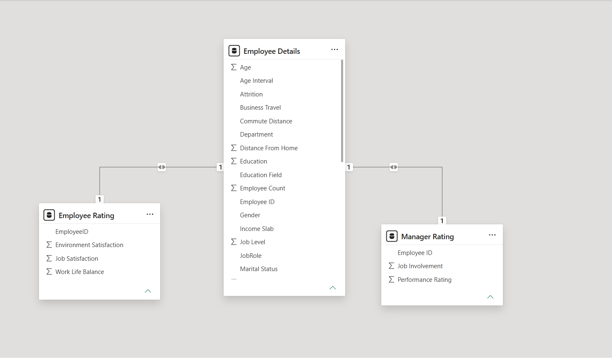

## Tools & Technologies

- Excel — data analysis, exploratory analysis
- Power Query — pivot tables and functions used for analysis
- Power BI — a supplementary version of the dashboard was also built here (see [Project Structure](#powerbi.png))

## Project Structure

This project consists of the following files:

- `.xlsx` — Source dataset used for cleaning, preparation, analysis, and dashboard visuals (primary deliverable)
- `.pbix` — Power BI version of the dashboard, built on the same dataset

## Data Cleaning & Preparation

Data cleaning was performed by identifying duplicate records and addressing missing values through imputation.

## Data Analysis

The analysis was performed in Excel, where several calculated columns and measures were created for deeper insights:

- Categorized several columns to help identify the root cause within specific ranges
- Checked the dataset for outliers as part of the cleaning process

### Formulas

To display the total count of employees (column A in General_Data refers to the unique Employee ID):
```excel
=COUNT(General_Data!A:A)
```

To display the count of employees still active in the system:
```excel
=COUNTIF(General_Data!C:C, "No")
```

To display the count of employees who resigned/left:
```excel
=COUNTIF(General_Data!C:C, "Yes")
```

Gender-wise total count and attrition %:

Female:
```excel
=COUNTIF(General_Data!J:J, "Female")
=COUNTIFS(General_Data!J:J, "Female", General_Data!C:C, "Yes")
' Percentage = Attrition count / Total count
```

Male:
```excel
=COUNTIF(General_Data!J:J, "Male")
=COUNTIFS(General_Data!J:J, "Male", General_Data!C:C, "Yes")
' Percentage = Attrition count / Total count
```

Interactive labels for department total employees and attrition, driven by a slicer selection:
```excel
Dept-Total Employees: =CONCATENATE("Dept-Total Employees: ", TEXTJOIN("  \  ", TRUE, A5))
Dept-Total Attrition:  =CONCATENATE("Dept-Total Attrition: ", TEXTJOIN("   ", TRUE, B17))
```

### Grouping / Bucketing Formulas

Grouping years worked with the current manager, to find a link with attrition:
```excel
=IF(X2<=5,"0–5",
   IF(X2<=10,"6–10",
      IF(X2<=15,"11–15",
         "16+"
        )
    )
)
```

Grouping salary ranges to correlate with attrition:
```excel
=IF(N2<=50000,"Below 50k",
   IF(N2<=100000,"50k to 100k",
      IF(N2<=150000,"100k to 150k",
         IF(N2<=200000,"200k","Above 200k")
        )
    )
)
```

Grouping commute distance to evaluate attrition percentage:
```excel
=IF(F2<=5,"Within 5 miles",
    IF(F2<=10,"Within 10 miles",
       IF(F2<=15,"Within 15 miles",
          IF(F2<=20,"Within 20 miles","More than 20 miles")
        )
    )
)
```

Grouping salary hike percentage to identify top performers and their attrition:
```excel
=IF(Q2<=15, "Good",
    IF(Q2<=20, "Excellent", "Outstanding")
)
```

Grouping age to correlate age with attrition:
```excel
=IF(B2<=30,"18 to 30 years",
    IF(B2<=40,"31 to 40 years",
       IF(B2<=50,"41 to 50 years",
          IF(B2<=60,"51 to 60 years","60+ years")
        )
    )
)
```

## Key Visualizations & Insights

The dataset was analyzed to find correlations between employee attributes and attrition.

**1. Department-wise attrition**
Identifying the root cause started with finding the highest-attrition department, visualized with a column chart.

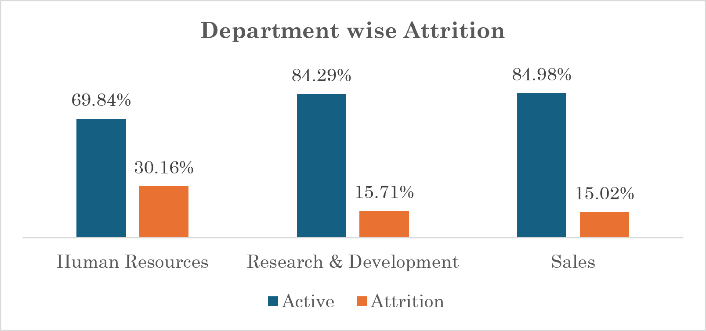

This clearly shows HR department's attrition is high compared to its total headcount. Further analysis was needed to find the other contributing factors.

**2. Attrition by gender**
Evaluated to check for gender-based discrimination or disparity. No meaningful difference was identified. Represented with a pie chart.

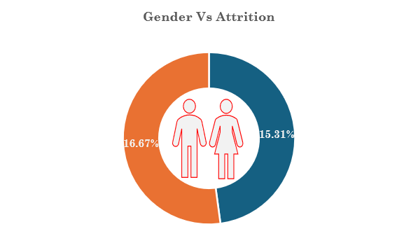

**3. Job role and attrition**
Analyzed to check for a correlation between job role and attrition, using a horizontal column chart across all roles in the organization.

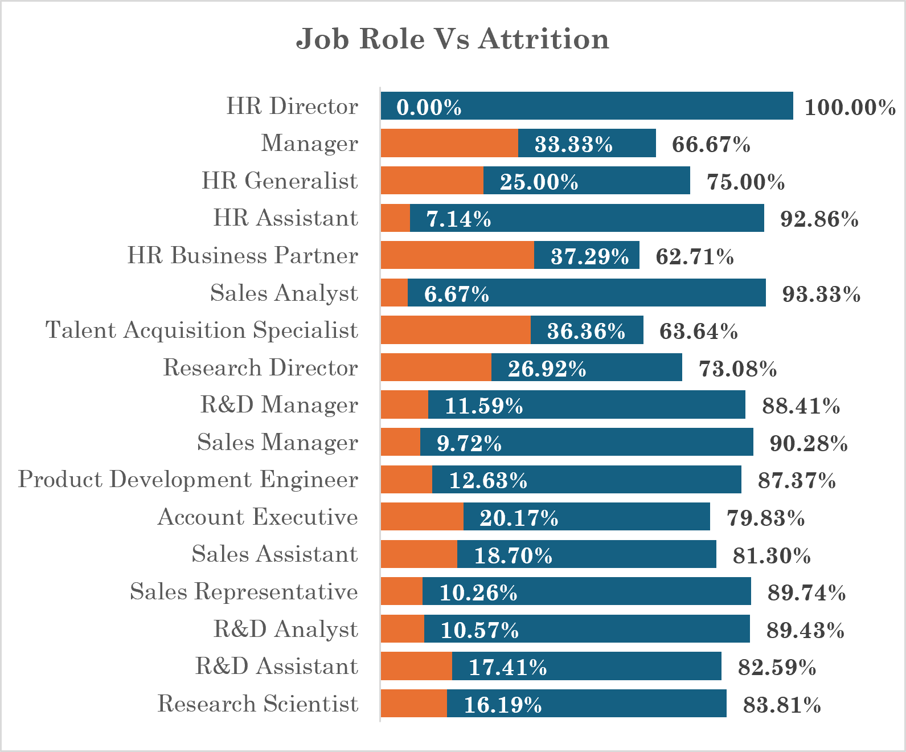

**4. Age impact on attrition**
The highest attrition is seen in the 18–30 age bracket, accounting for 41% of attrition. This may point to a lack of challenging work or stagnated growth and learning opportunities. Represented with a pie chart.

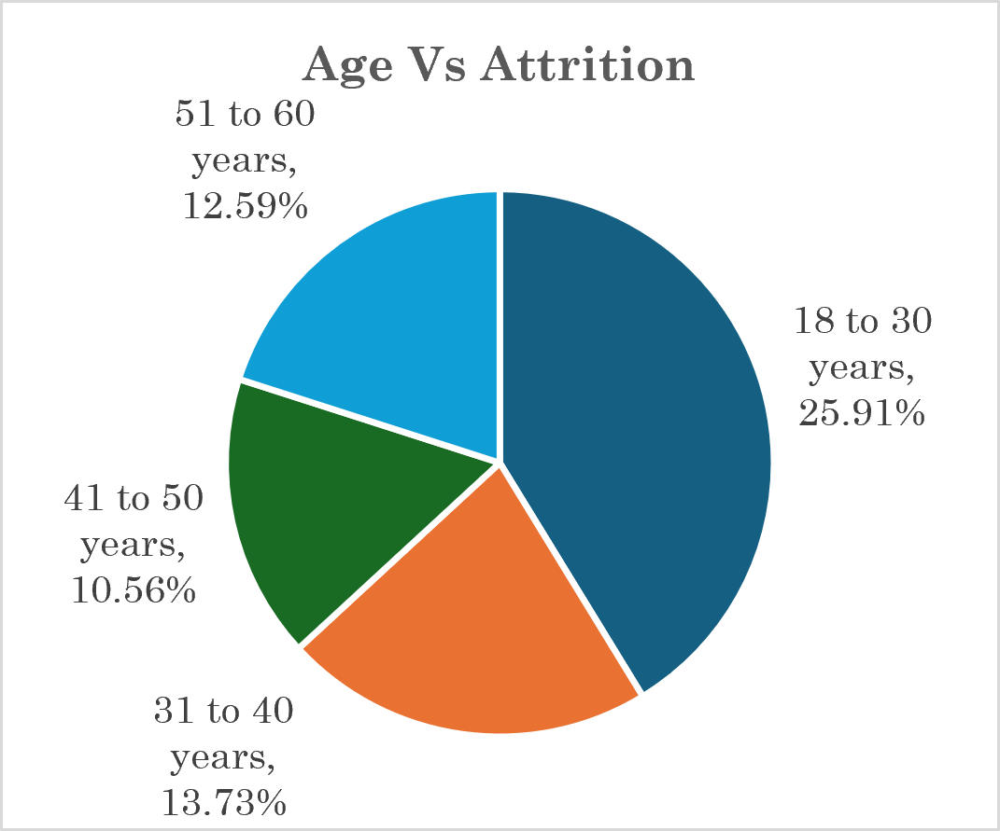

**5. Talent leaving the organization**
Every organization is concerned about losing top talent, so a chart was built to check the relationship between performance rating and attrition.

The chart clearly shows higher attrition among top performers, which is concerning and needs priority investigation.

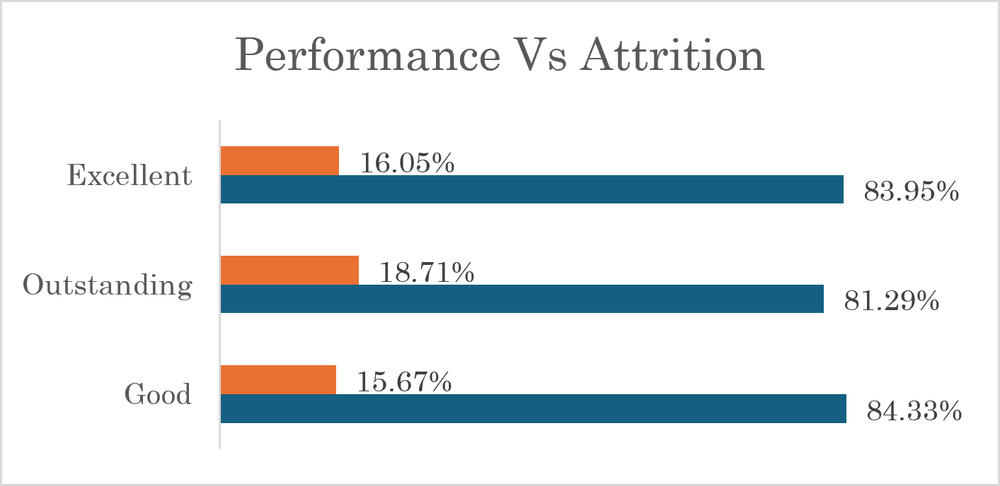

**6. Compensation as a factor**
The column chart clearly shows lower-compensation groups have a higher attrition rate. The organization should revise its salary structure based on skill, performance, and market benchmarks.

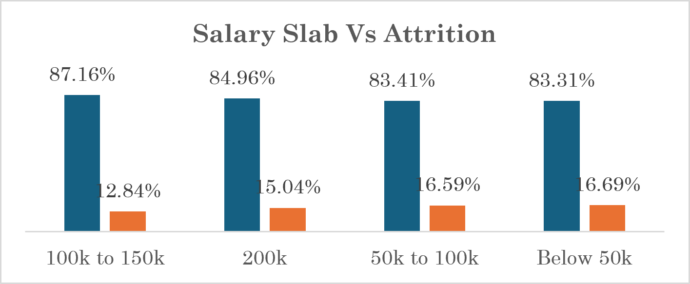

**7. Tenure with current manager and attrition**
Employees who have worked with their current manager for under 5 years show notably high attrition, potentially pointing to a lack of engagement or connection with their manager.

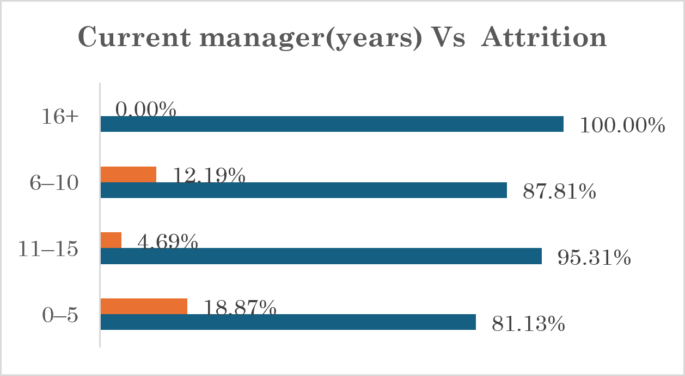

**8. Commute distance and attrition**
The data shows a mixed impact here, suggesting commute distance is not a major driver of attrition.

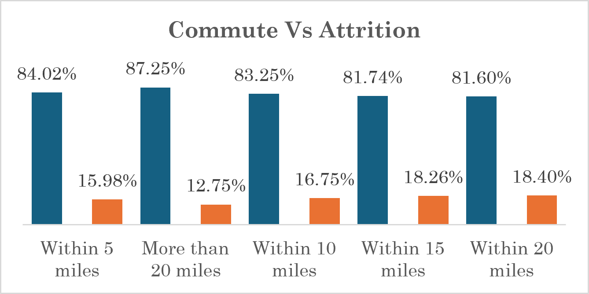

**9. Employee and manager rating heat map**
Employee and manager ratings were mapped on a heat map to identify which dimension scores lowest (out of 5):

**Employee ratings:**
- Work-Life Balance — 2.74
- Job Satisfaction — 2.72
- Environment Satisfaction — 2.71

**Manager ratings:**
- Performance Rating — 3.15
- Job Involvement — 2.73

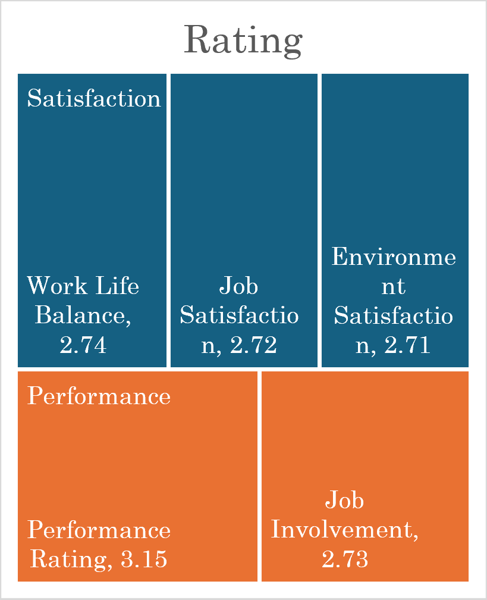

These ratings indicate employees are not satisfied with the workplace culture, and manager ratings suggest low job involvement — potentially due to a lack of role clarity or growth opportunities, which may also be affecting performance.

**10. Overall satisfaction by role**
Overall employee satisfaction by role is shown in a line chart to highlight the most problematic roles.

> **Note:** the line chart shows a sharp dip to 1.67 for one role, well below the 2.6–2.9 range for all others. This should be verified against the source data before publishing, since it looks like a possible outlier or data entry issue rather than a genuine trend.

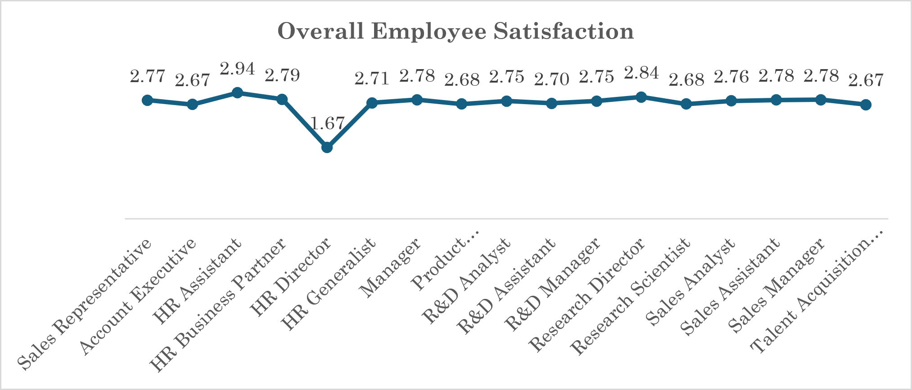

## Research Questions & Key Findings

1. Employee satisfaction scores are lower than the benchmark, indicating employees are unhappy continuing to work at the organization, which drives higher attrition.
2. The organization has varying issues by department; each department head needs to work with their manager on an action plan based on this analysis.
3. A major concern is that top talent is leaving the organization, which will be costly. Retention strategies should be planned as a priority, potentially tied to compensation revision and career planning.
4. Despite having a low headcount, the HR department shows disproportionately high attrition — interviews with the team are recommended to understand the specific issue.
5. Employees aged 18–30 are leaving the organization at a high rate, which may be linked to compensation, manager connection, or commute; a focus group discussion is recommended.
6. Manager connection appears to be an issue, as employees with under 5 years' tenure with their current manager show high attrition. The organization should consider skip-level meetings, town halls, and regular one-on-ones to build stronger manager relationships.

## Dashboard

The Excel dashboard includes:

- Headcount, Active Employees, Attrition Count, and Attrition Rate, plus department-wise headcount and attrition, for stakeholder visibility
- Attrition mapped against the following drivers:
  1. Department-wise attrition — horizontal column chart
  2. Gender-wise attrition — pie chart
  3. Age group-wise attrition — pie chart
  4. Job role-wise attrition — horizontal column chart, plus a line chart for overall satisfaction
  5. Performance-wise attrition — column chart
  6. Compensation-wise attrition — column chart
  7. Years of experience with current manager vs. attrition
  8. Daily commute vs. attrition
  9. Heat map linking all rating dimensions to attrition


## How to Run This Project

**Excel (primary):**
1. Download the `.xlsx` file.
2. Open it in Excel (enable macros/data connections if prompted).
3. Go to the Dashboard tab to view the interactive report.
4. Use the Department and Job Role slicers on the left to filter all charts by your selection.

**Power BI (supplementary):**
1. Download the `.pbix` file.
2. Open it in Power BI Desktop.
3. If prompted, update the data source path to point to the `.xlsx` file on your machine, then refresh the data.

## Final Recommendations

1. Appoint a cross-functional panel (Talent Acquisition, HR, Learning & Development, and other relevant departments) to build a strategy for retaining top talent.
2. Enhance engagement plans to improve overall employee satisfaction with work culture and job role.
3. Restructure compensation based on skill, years of experience, performance, and market analysis, and add perks and benefits to help attract and retain talent.

## Author & Contact

- **Name:** Amulya Sadige
- **Email:** amulya.sadige92@gmail.com
- **LinkedIn:** (https://linkedin.com/in/amulya-sadige)
- **GitHub:** (https://github.com/amulyasadige92)
